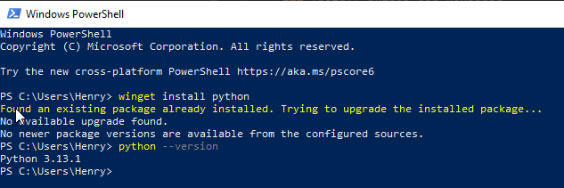
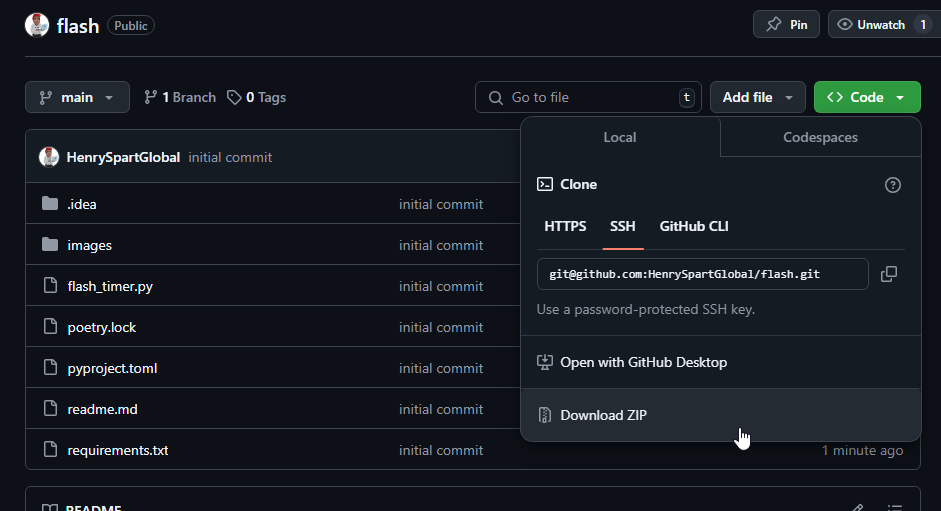

# LoL Flash timer use

**_This only works in windows._** 

Start a timer from 5 minutes when flash is used in game. Could be improved to consider runes and boots?

This will work even while you have League of legends open. No need to tab out.

### Step 1 - Install python and keyboard (Essential)
1. Open Windows Powershell. You will type the next commands into this terminal.
2. Install Python via winget

```angular2html
winget install python
```

3. Or download from [python.org](https://www.python.org/downloads/) and check “Add Python to PATH” during installation.
4. Confirm python is installed 

```angular2html
python --version
```



5. You should see a valid version, e.g. `Python 3.xx.x`
6. This script needs the `keyboard` python library so install that in the same powershell window with:

```angular2html
python -m pip install keyboard
```

7. Download this as a zip. Unzip it and place the folder on your **Desktop**. (You can put it anywhere, but Desktop is easiest for most)



### Step 2 - Run the script (Optional - Skip to step 3 to run via bat)

7. Still in powershell, you should be in the C drive, where your desktop lives. 


8. From here Type `cd desktop` and press enter. You're now in the desktop "folder".


9. If you want to confirm type `ls` - this will list all your files on the desktop. You should see the `flash` folder here.

11. Now we want to `cd` into the flash folder 

```angular2html
cd flash
```


10. Then run the script with `python .\flash_timer.py`
11. OR `python` then just press **TAB**, it should pick up the only python file in here. 


12. Then press enter to run, should open a small window. And the app is running 


Slap this on a second monitor, or put it over your game, and you should be Challenger in 2 weeks


### Step 3 - Running via Bat 
The steps above was just step by step. But you can run the script via bat.

1. Open the `run_flash.bat` file. 
2. Edit the path to point where you downloaded this repository. Ideally, the desktop.
For me, it looks like `python C:\Users\Henry\Desktop\flash\flash_timer.py`. Make sure to save it. 
3. Move the bat file anywhere you like. Make sure to save it. Now you can double-click this bat file to run the script.

It will start with Administrator privileges, this is so that your hot keys are picked up while having a game in focus.

**Yes you will see a black terminal open and close immediately, I did not just hack you, this is so that **only** the flash timer app stays open instead of an additional black console windows. 

### Change hot keys
If you want to change the hot keys open the `flash_timer.py` (open with any text editor) - and update the `key_for_x` variables at the very top. 
Make sure you save it, and rerun the program. 