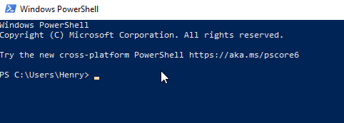
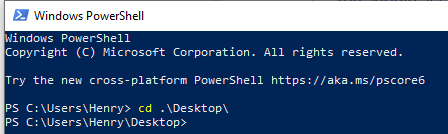
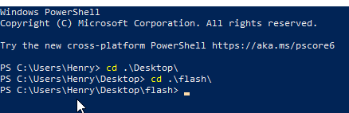
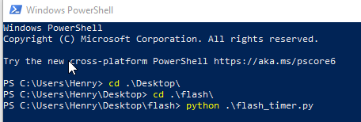
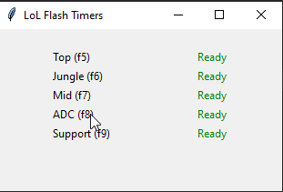

# LoL Flash timer use

This only works in windows 

### Install python and keyboard
1. Open Windows Powershell. You will type the next commands into this terminal.
2. Install Python via winget

```angular2html
winget install python
```

3. Or download from [python.org](https://www.python.org/downloads/) and check “Add Python to PATH” during installation.
4. Confirm python is installed 

```angular2html
python --version
```

5. You should see a valid version, e.g. `Python 3.xx.x`
6. This script needs the `keyboard` python library so install that in the same powershell window with:

```angular2html
python -m pip install keyboard
```

### Run the script 
6. Download the zip file I sent. Unzip it and place the folder on your desktop.
7. Open powershell. It should open in the C drive for you, where the Desktop lives. 



8. From here Type `cd desktop` and press enter. You're now in the desktop "folder".


9. If you want to confirm type `ls` - this will list all your files on the desktop. You should see the `flash` folder here.

11. Now we want to `cd` into the flash folder 

```angular2html
cd flash
```



10. Then run the script `flash_timer.py`
11. Type `python` then just press TAB, it should pick up the only python file in here. 



12. Then press enter to run, should open a small window. And the app is running 




### Running this everyday 
The steps above was just step by step. But you can run the script straight away as soon as ur powershell is open.

1. To run this quickly everyday just copy and paste this into your powershell. (Assuming the folder is on your desktop)

```angular2html
python .\Desktop\flash\flash_timer.py
```


### Change hot keys
If you want to change the hot keys open the `flash_timer.py` (open with any text editor) - and update the `key_for_x` variables at the very top. 
Make sure you save it, and rerun the program. 